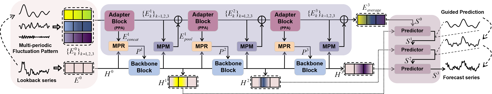
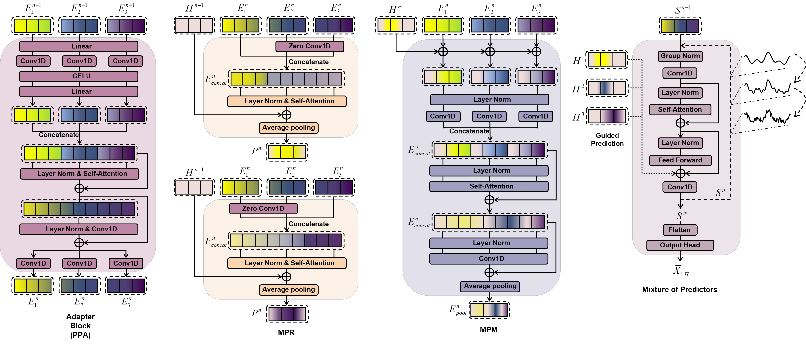

# Pets (Submitted to KDD 2026)

### This is an offical implementation of "Pets: Generalizable Pattern Assisted Architecture for Time Series Analysis" submitted to KDD2026. 

[//]: # (:triangular_flag_on_post: Our model has been included in [GluonTS]&#40;https://github.com/awslabs/gluonts&#41;. Special thanks to the contributor @[kashif]&#40;https://github.com/kashif&#41;!)

[//]: # (:triangular_flag_on_post: Our model has been included in [NeuralForecast]&#40;https://github.com/Nixtla/neuralforecast&#41;. Special thanks to the contributor @[kdgutier]&#40;https://github.com/kdgutier&#41; and @[cchallu]&#40;https://github.com/cchallu&#41;!)

[//]: # (:triangular_flag_on_post: Our model has been included in [timeseriesAI&#40;tsai&#41;]&#40;https://github.com/timeseriesAI/tsai/blob/main/tutorial_nbs/15_PatchTST_a_new_transformer_for_LTSF.ipynb&#41;. Special thanks to the contributor @[oguiza]&#40;https://github.com/oguiza&#41;!)


This paper presents a novel architecture capable of adapting to various time-series analysis tasks. Such a universal pattern recognition strategy can enhance the performance of existing methods.





## Getting Started

1. Install requirements. 

```
pip install -r requirements.txt
```

3. Download data. You can download all the datasets from Autoformer. Create a seperate folder ```./dataset``` and put all the csv files in the directory.

4. Training. All the scripts are in the directory ```./scripts```. In the experimental results presented in the manuscript, we choose **transformer-based Pets** as the default setting, named as **PatchTST-Adapter**. Similarly, we also provide **TimeMixer-Adapter**, **DLinear-Adapter**, and **TimesNet-Adapter** to represent **Linear and convolutional based Pets**, respectively. For example, if you want to get the multivariate forecasting results for **ETT** dataset, just run the following command, and you can open ```./result.txt``` to see the results once the training is done:

```
bash ./scripts/long_term_forecast/ETT_script/PatchTST_Adapter/ETTh1_32.sh

bash ./scripts/long_term_forecast/ETT_script/PatchTST_Adapter/ETTh2_16.sh

bash ./scripts/long_term_forecast/ETT_script/PatchTST_Adapter/ETTm1_16.sh

bash ./scripts/long_term_forecast/ETT_script/PatchTST_Adapter/ETTm2_16.sh
```

In addition, we provide scripts for anomaly detection and zero-shot inference.

```
bash ./scripts/anomaly_detection/SMD/TimeMixer_Adapter.sh

bash ./scripts/anomaly_detection/SMD/TimesNet_Adapter.sh

bash ./scripts/anomaly_detection/SMD/PatchTST_Adapter_8.sh

bash ./scripts/anomaly_detection/SMD/PatchTST_Adapter_16.sh

bash ./scripts/anomaly_detection/SMD/PatchTST_Adapter_32.sh
```

and

```
bash ./scripts/zero_shot/PatchTST_Adapter/ETTh1_32.sh

bash ./scripts/zero_shot/PatchTST_Adapter/ETTh2_16.sh

bash ./scripts/zero_shot/PatchTST_Adapter/ETTm1_16.sh

bash ./scripts/zero_shot/PatchTST_Adapter/ETTm2_16.sh
```

You can adjust the hyperparameters based on your needs (e.g. different patch length, different look-back windows and backbone modules.). We also provide codes for the baseline models.

